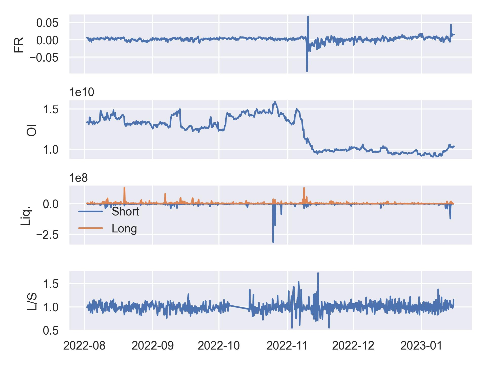

# Coinglass API

## Unofficial Python client for Coinglass API

Wrapper around the [Coinglass API](https://coinglass.com/pricing) to fetch data about the crypto markets.
All data is output in pandas DataFrames (single or multi index).

**Note**: This is work in progress. The API is not stable yet.



## Installation

```bash
pip install coinglass-api
```

## Usage

Currently only supports the `indicator` API endpoint.

```python
from coinglass_api import CoinglassAPI

cg = CoinglassAPI(api_key="abcd1234")

# Get average funding for Bitcoin
fr_avg = cg.average_funding(symbol="BTC", interval="h4")

# Get aggregated OI OHLC data for Bitcoin
oi_agg = cg.open_interest_aggregated_ohlc(symbol="BTC", interval="h4")

# Get liquidation data for Bitcoin
liq = cg.liquidation_symbol(symbol="BTC", interval="h4")

# Get long/short ratio data for Bitcoin
lsr = cg.long_short_symbol(symbol="BTC", interval="h4")
```


## Disclaimer

This project is for educational purposes only. You should not construe any such information or other material as legal,
tax, investment, financial, or other advice. Nothing contained here constitutes a solicitation, recommendation,
endorsement, or offer by me or any third party service provider to buy or sell any securities or other financial
instruments in this or in any other jurisdiction in which such solicitation or offer would be unlawful under the
securities laws of such jurisdiction.

Under no circumstances will I be held responsible or liable in any way for any claims, damages, losses, expenses, costs,
or liabilities whatsoever, including, without limitation, any direct or indirect damages for loss of profits.